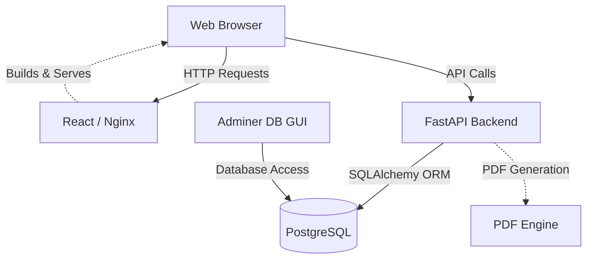
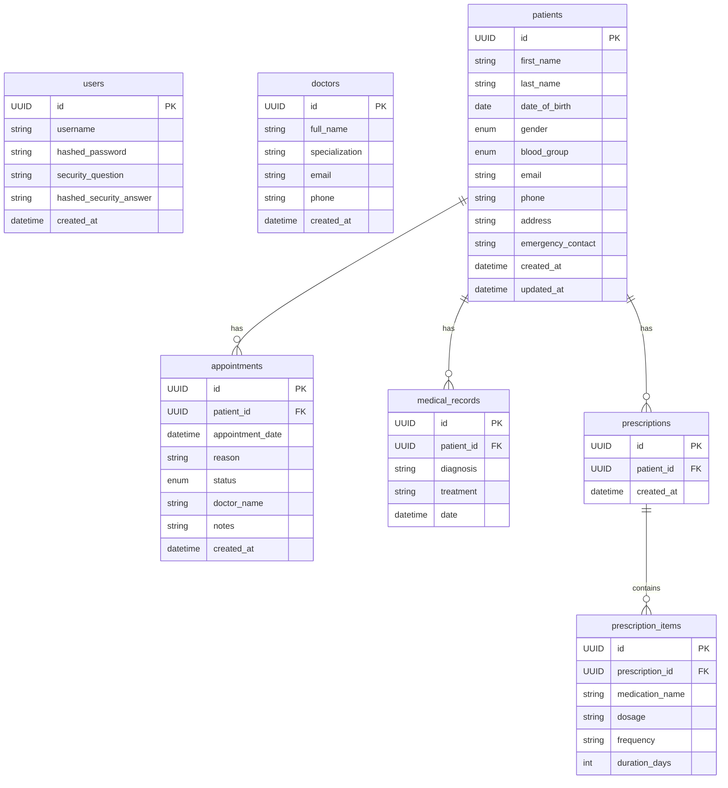
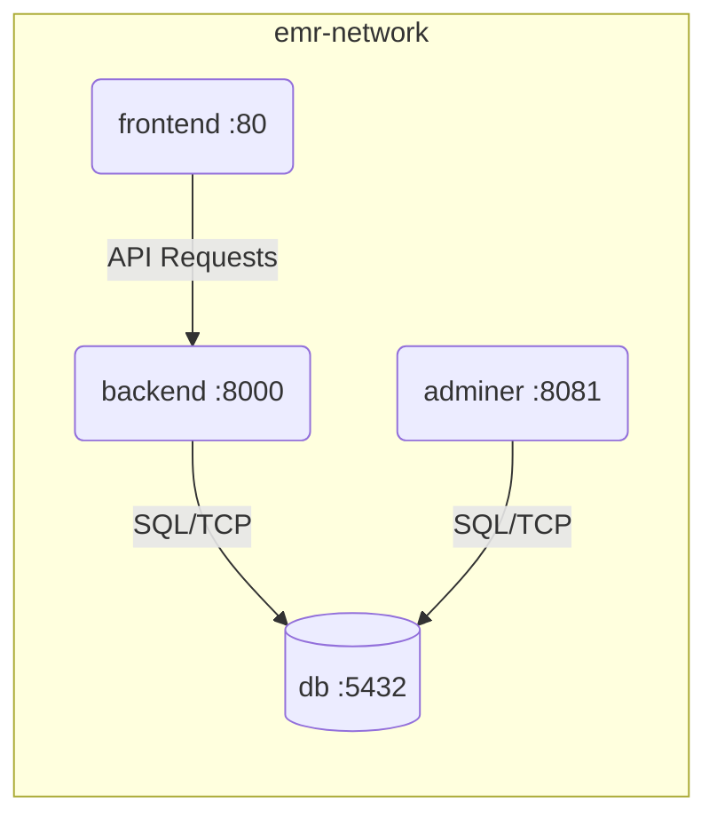

# EMR System

A comprehensive Electronic Medical Record (EMR) system built with a modern web stack, featuring a React frontend, FastAPI backend, and PostgreSQL database. The entire application is containerized using Docker and orchestrated with Docker Compose.

## 🚀 Tech Stack

### Frontend
* **Framework:** React 18 with Vite
* **Language:** TypeScript
* **Styling:** Tailwind CSS
* **Routing:** React Router DOM
* **HTTP Client:** Axios
* **Icons:** Lucide React

### Backend
* **Framework:** FastAPI (Python)
* **Server:** Uvicorn
* **ORM:** SQLAlchemy 2.0
* **Data Validation:** Pydantic
* **Database Migrations:** Alembic
* **Authentication:** JWT (python-jose, bcrypt)
* **PDF Generation:** fpdf2

### Infrastructure & Database
* **Database:** PostgreSQL 15
* **Database Management:** Adminer
* **Containerization:** Docker & Docker Compose
* **Web Server:** Nginx (for serving the frontend)

## 🏗️ Project Architecture



## 🗄️ Database Architecture (ER Diagram)



*(Note: The `medical_records`, `prescriptions`, and `prescription_items` tables contain more detailed clinical fields in the actual implementation.)*

## 🐳 Docker Compose Architecture

The application is orchestrated using Docker Compose with the following services:

1. **`db` (PostgreSQL 15):** The core relational database storing all system data. Uses a mapped volume (`pgdata`) to persist data across container restarts.
2. **`adminer`:** A lightweight database management interface running on port `8081`. Allows for easy visual inspection and manipulation of the PostgreSQL database.
3. **`backend`:** The FastAPI application running on port `8000`. It depends on the `db` service and waits for it to be healthy before starting. Connects to the database using environment variables defined in `.env`.
4. **`frontend`:** The React application built and served by Nginx on port `80`. It depends on the `backend` service being up.



## ⚙️ How to Run

1. **Prerequisites:** Ensure you have Docker and Docker Compose installed on your machine.
2. **Environment Variables:** Create a `.env` file in the root directory (or use the existing one) with the necessary database and backend configurations.
3. **Start the System:**
   ```bash
   docker-compose up -d --build
   ```
4. **Access the Services:**
   * **Frontend:** `http://localhost` (or `http://localhost:80`)
   * **Backend API Docs (Swagger UI):** `http://localhost:8000/docs`
   * **Database Management (Adminer):** `http://localhost:8081`

To stop the services, run:
```bash
docker-compose down
```
